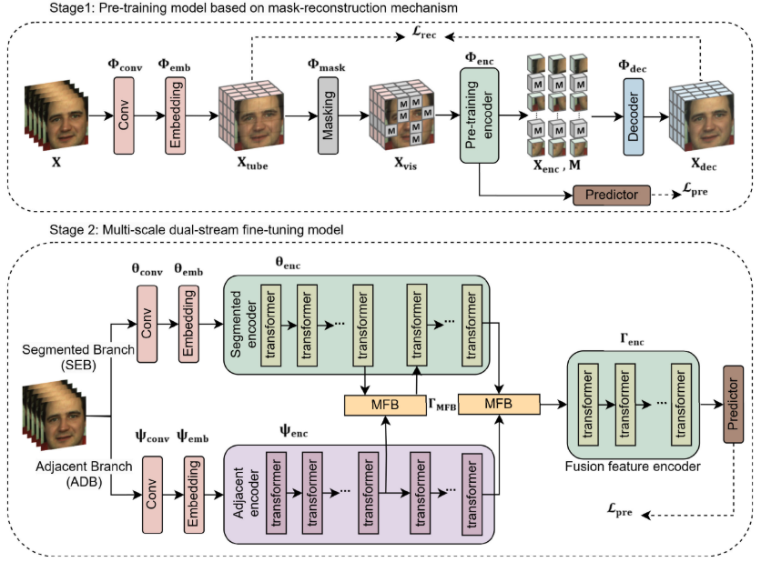
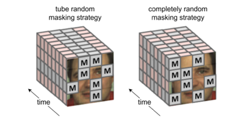

# MaskFusionNet

A PyTorch reimplementation of **MaskFusionNet**, a dual-stream transformer with masked pretraining for remote photoplethysmography (rPPG): estimating heart rate from RGB facial video. The code follows the paper closely and documents every assumption made where the paper is underspecified. It includes unit tests, a two-stage training pipeline, and an independent evaluation on UBFC-rPPG.

[](https://github.com/ShaheryarKhanZai/MaskFusionNet/actions)
[]()
[]()
[](LICENSE)

**Paper:** Y. Zhang, J. Shi, J. Wang, Y. Zong, W. Zheng, G. Zhao, *"MaskFusionNet: A Dual-Stream Fusion Model With Masked Pre-Training Mechanism for rPPG Measurement,"* IEEE TCSVT, vol. 34, no. 11, pp. 11521–11534, 2024. [DOI: 10.1109/TCSVT.2024.3422849](https://doi.org/10.1109/TCSVT.2024.3422849)

---

## Key results

Ablation on the UBFC-rPPG setup used in this repository (held-out, subject-independent test split, single run):

| Model | MAE (bpm) ↓ | RMSE (bpm) ↓ | SD (bpm) ↓ | Pearson r ↑ |
|---|---:|---:|---:|---:|
| Without masked pretraining | 4.80 | 7.81 | 7.78 | 0.73 |
| MaskFusionNet + masked pretraining | **4.51** | **7.09** | **7.01** | **0.79** |

In this experiment, masked pretraining improved all four metrics. This is one run on a small dataset, so the size of the improvement should be read with caution (see [Limitations](#limitations)).

Other facts:

- 34 unit tests that check implementation behaviour. They need no dataset or GPU.
- Evaluation protocol, hardware and training settings are listed in [Training](#training) and [Evaluation](#evaluation).
- The paper evaluates on VIPL-HR, COHFACE and PURE, not UBFC-rPPG. The numbers here are not comparable to the paper's tables.

---

## Contents

1. [Background](#background)
2. [Architecture](#architecture)
3. [Implementation details](#implementation-details)
4. [Implementation audit](#implementation-audit)
5. [Training](#training)
6. [Evaluation](#evaluation)
7. [Results and ablation](#results-and-ablation)
8. [Tests](#tests)
9. [Reproducibility](#reproducibility)
10. [Limitations](#limitations)
11. [Future work](#future-work)
12. [Repository structure](#repository-structure)
13. [Citation](#citation)
14. [Contributing](#contributing)

---

## Background

rPPG estimates pulse information from small, periodic skin-colour changes caused by blood-volume changes. It uses ordinary RGB video and no contact sensor. Heart rate is then read from the dominant frequency of the recovered pulse waveform.

The paper proposes a two-stage model.

1. **Masked pretraining.** Tube masking hides the same spatial regions in every frame. The paper motivates this as a way to force the encoder to recover pulse information from the regions that remain visible, instead of depending only on the strongest signal regions such as the forehead and cheeks.
2. **Dual-stream fine-tuning.** A fine-grained *Adjacent Branch* (ADB) and a coarse *Segmented Branch* (SEB) are combined by a *Multi-Scale Fusion Block* (MFB) that uses cross-branch interactive attention.

This repository implements both stages and evaluates the effect of the pretraining stage on UBFC-rPPG.

---

## Architecture

<p align="center">
  
</p>

<sub>Architecture diagram based on Fig. 2 of Zhang et al. (2024).</sub>

**Two branches.** ADB uses a fine temporal tube (2 frames per token) to capture subtle frame-to-frame variation. SEB uses a coarser tube (4 frames per token) for longer-range patterns. MFB lets SEB attend to ADB (Eq. 8–10).

**Stage 1: masked pretraining**

```
Video clip
    │
ConvBlock + tube embedding        [B, 96, T/4, H/32, W/32]
    │
Tube masking (ρ = 0.75, one spatial mask repeated over all time steps)
    │
Encoder (12 transformer layers) ──▶ Predictor ──▶ prediction loss
    │
Decoder (6 lightweight layers)
    │
Reconstruction loss against the pre-masking tokens, masked positions only
```

**Stage 2: fine-tuning.** ADB and SEB run in parallel. Their features are fused by two MFB blocks followed by a fusion encoder. The network outputs a predicted rPPG waveform, and heart rate is read from it with a bandpass filter and FFT.

**Pretrained-weight transfer.** SEB receives the first 8 pretrained encoder layers. The fusion encoder receives the last 4. ADB is trained from scratch because its tube size gives a different token layout. See `MaskFusionNet.load_pretrained_encoder()` in [`src/maskfusionnet/models/maskfusionnet.py`](src/maskfusionnet/models/maskfusionnet.py).

**Tensor shapes** (from `python scripts/inspect_shapes.py --T 160 --H 128 --W 128`, saved to [`results/tables/shape_trace.txt`](results/tables/shape_trace.txt)):

| Stage | Tensor | Shape `[B, C, T, H, W]` |
|---|---|---|
| Input | raw clip | `(1, 3, 160, 128, 128)` |
| 1 | after ConvBlock | `(1, 96, 160, 16, 16)` |
| 1 | tube tokens (tube 4,4,4) | `(1, 96, 40, 4, 4)` |
| 1 | decoder output | `(1, 96, 40, 4, 4)` |
| 1 | predictor output | `(1, 160)` |
| 2 | ADB tokens (tube 2,4,4) | `(1, 96, 80, 4, 4)` |
| 2 | SEB tokens (tube 4,4,4) | `(1, 96, 40, 4, 4)` |
| 2 | ADB aligned to SEB (AvgPool ÷2) | `(1, 96, 40, 4, 4)` |
| 2 | after MFB #1 / MFB #2 / fusion encoder | `(1, 96, 40, 4, 4)` |
| 2 | predicted rPPG signal | `(1, 160)` |

---

## Implementation details

- **Embedding:** 3D-conv stem and tube-token embedding (Eq. 1–2).
- **Attention:** multi-head self-attention over the spatio-temporal token sequence (Eq. 4–7).
- **Masking:** tube random masking with mask ratio 0.75. The same spatial mask is used for every frame (Eq. 3, Fig. 3).
- **Branches:** ADB and SEB are separate encoders with separate weights.
- **MFB:** queries come from SEB, keys and values from ADB, followed by a residual connection (Eq. 8–10).
- **Reconstruction loss:** spatial MSE plus a temporal-smoothness L1 term (Eq. 15–17).
- **Prediction loss:** negative Pearson correlation plus a frequency-domain CE/KL term over 140 HR classes (Eq. 18–19).
- **Heart-rate estimation:** predicted waveform → bandpass filter → FFT → BPM.
- **Tooling:** YAML configs, checkpoints that always report missing and unexpected keys, mixed precision (`use_amp`), gradient accumulation, resume support, Docker.
- **Demo:** a real-time webcam script (webcam → face detection → rolling buffer → model → bandpass → FFT → BPM). It is a demo only and was not part of the evaluation above.

### Paper details that are underspecified

The paper does not fully specify the pooling stride, whether masking happens at pixel or token resolution, MFB weight sharing, or the HR-binning procedure. Each is resolved with an explicit assumption, listed under "Ambiguities" in [`AUDIT.md`](AUDIT.md).

---

## Implementation audit

The model was first implemented in 2024. After gaining a stronger understanding of deep learning and computer vision, I revisited it, audited it against the paper, and found several implementation issues. These were corrected, covered with unit tests, and the corrected model was then trained and evaluated. [`AUDIT.md`](AUDIT.md) has the full bug-by-bug report.

| Component | Previous implementation | Corrected implementation |
|---|---|---|
| Attention | Per-position gate; tokens were not mixed (audit bug #1) | Multi-head self-attention over the token sequence. A test checks that tokens influence each other |
| ADB / SEB | Branch weights were aliased, so the two branches shared parameters (audit bug #2) | Independent ADB and SEB encoders |
| Masked pretraining | No genuine masked-pretraining stage | Stage 1 with tube masking, a decoder and the reconstruction + prediction losses |
| MFB | Issues listed in `AUDIT.md` | Q from SEB, K/V from ADB, with a residual connection. A test checks the residual path |
| Pretrained transfer | Checkpoint loading could hide mismatched keys (audit bug #9) | Layer mapping 8 / 4 / 0 (SEB / fusion encoder / ADB). Loading reports missing and unexpected keys, with no silent `strict=False` |
| Demo | Random jitter was added to the displayed BPM (audit bug #8) | Displayed BPM is the fresh estimate or a documented moving average |

---

## Training

Training has two stages.

```bash
# Stage 1: masked pretraining
python scripts/train_pretrain.py --config configs/pretrain.yaml

# Stage 2: fine-tuning (loads the Stage 1 checkpoint, see configs/finetune.yaml)
python scripts/train_finetune.py --config configs/finetune.yaml

# Ablation: fine-tune without pretraining
python scripts/train_finetune.py --config configs/finetune.yaml --no_pretrain
```

Both scripts support `--resume`, read the dataset root from `MASKFUSIONNET_UBFC_ROOT`, and write per-epoch checkpoints and a CSV metrics log.

### Configuration: paper vs. this repository

| Setting | Paper | This repository |
|---|---|---|
| Mask ratio ρ | 0.75 | 0.75 |
| Loss weights α, β, γ | 1.0, 1.0, 1.0 | 1.0, 1.0, 1.0 |
| Prediction-loss weights | λ = 0.1; µ follows the dynamic schedule in Eq. 19 (µ₀ = 1.0, η = 5.0, first 25 epochs, then µ = µ₀) | Same as the paper |
| Pretraining | Adam, lr 2e-6, wd 5e-5, batch 8, 400 epochs | 200 epochs, batch size 2. Optimizer, lr and wd in [`configs/pretrain.yaml`](configs/pretrain.yaml) |
| Fine-tuning | Adam, wd 5e-5, batch 4, lr 1e-4 (VIPL-HR, COHFACE) or 3.5e-3 (PURE) | 200 epochs, batch size 2. Optimizer, lr and wd in [`configs/finetune.yaml`](configs/finetune.yaml) |
| Data loading | n/a | 2 DataLoader workers |
| Hardware | not stated | NVIDIA T4 (16 GB), Google Colab |
| Runs | n/a | 1 |

In `configs/*.yaml`, values taken from the paper are marked `(paper)` and UBFC-specific choices are marked `(ours)`.

---

## Evaluation

```bash
python scripts/evaluate.py --config configs/finetune.yaml \
    --checkpoint checkpoints/finetune/best.pt
```

Results are written to `results/tables/eval_results.json`.

**Data.** [UBFC-rPPG](https://sites.google.com/view/ybenezeth/ubfcrppg), split by subject into 70 / 15 / 15 (train / validation / test). Clips are 160 frames at 128×128 and 30 fps.

```bash
export MASKFUSIONNET_UBFC_ROOT=/absolute/path/to/UBFC-rPPG
python scripts/prepare_ubfc.py     # lists subjects and prints the train/val/test split
```

Data layout and ground-truth format are described in [`data/README.md`](data/README.md).

**Protocol.** For each test clip, the predicted waveform is bandpass filtered and converted to a heart rate with an FFT. This is compared with the ground-truth HR for the same clip. MAE, RMSE, SD and Pearson r are computed over the per-clip estimates of the held-out subjects.

### Differences from the paper's setup

| | Paper | This repository |
|---|---|---|
| Datasets | VIPL-HR, COHFACE, PURE | UBFC-rPPG |
| Face detector | FAN | Haar cascade (OpenCV) |
| Split | 5-fold on VIPL-HR, dataset-specific otherwise | Subject-level 70 / 15 / 15 |
| Clip length / size | 160 frames, 128×128, 30 fps | Same |
| Test protocol | 30 s videos cut into three 10 s segments, HR averaged | HR from each 160-frame clip, compared with ground truth per clip |

---

## Results and ablation

### This repository (UBFC-rPPG, held-out test subjects, single run)

| Model | MAE (bpm) ↓ | RMSE (bpm) ↓ | SD (bpm) ↓ | Pearson r ↑ |
|---|---:|---:|---:|---:|
| Without masked pretraining (`--no_pretrain`) | 4.80 | 7.81 | 7.78 | 0.73 |
| MaskFusionNet + masked pretraining | **4.51** | **7.09** | **7.01** | **0.79** |

Both models use the same fine-tuning setup. The only difference is whether the Stage 1 weights are loaded.

In our experiment, masked pretraining reduced MAE by 0.29 bpm, RMSE by 0.72 bpm and SD by 0.77 bpm, and raised Pearson r by 0.06. The experiment shows that the pretrained model scored better on these metrics. It does not isolate why. The explanation given in the paper (the encoder must recover information from the visible regions) is a motivation, not something tested here.

### Paper-reported numbers (for reference only)

These are the paper's pretrained vs. without-pretraining results. They use different datasets and protocols and are **not comparable** to the table above.

| Paper setting | Variant | MAE | RMSE | SD | r |
|---|---|---:|---:|---:|---:|
| VIPL-HR, 5-fold (Table I) | pretrained | 4.37 | 6.95 | 6.84 | 0.82 |
| VIPL-HR, 5-fold (Table I) | without pretraining | 4.67 | 7.61 | 7.57 | 0.77 |
| COHFACE (Table II) | pretrained | 1.27 | 2.22 | n/a | 0.98 |
| COHFACE (Table II) | without pretraining | 1.29 | 2.30 | n/a | 0.98 |
| PURE (Table III) | pretrained | 1.11 | 1.39 | n/a | 0.99 |
| PURE (Table III) | without pretraining | 1.09 | 1.41 | n/a | 0.99 |

The paper does not report results on UBFC-rPPG. UBFC-rPPG is small, well lit and near-frontal, while VIPL-HR contains heavy motion and lighting variation, so errors on the two should not be read against each other. In the direction of the pretraining effect, our single UBFC-rPPG run is consistent with the paper's VIPL-HR result, but it does not confirm the paper's numbers.

---

## Tests

The repository has 34 automated tests (`pytest tests/ -v`). They use synthetic tensors only, so CI runs without a GPU or dataset.

The tests check that the implementation behaves as intended. They say nothing about how accurate the model is. Accuracy is measured by the real-data evaluation above.

What they cover:

- Tube masking: the mask is identical across frames.
- Attention: tokens influence each other.
- MFB: the residual connection is present.
- Pretrained-weight mapping: the 8 / 4 / 0 split, and a report of missing and unexpected keys.
- Forward and backward passes for both stages at the paper's input size, with no NaNs and gradients reaching every parameter.
- Losses: reconstruction loss and prediction loss.
- Signal processing: BPM recovery from synthetic sinusoids between 45 and 160 bpm to within 3 bpm.
- Training loop: optimizer step, checkpointing, CSV logging and resume, on a small synthetic dataset.

**Pipeline verification figures.** These use a synthetic clip and a synthetic sinusoid. They check the masking and signal-processing code and are not model predictions.

Tube masking (identical spatial mask at every frame):



Signal processing (78 bpm synthetic sinusoid, FFT stage recovers 78.0 bpm):


---

## Reproducibility

```bash
git clone https://github.com/ShaheryarKhanZai/MaskFusionNet.git
cd MaskFusionNet
python -m venv .venv && source .venv/bin/activate
pip install -r requirements.txt && pip install -e .
pytest tests/ -v
```

Docker smoke test (runs `scripts/inspect_shapes.py`):

```bash
docker build -t maskfusionnet .
docker run maskfusionnet
```

To reproduce the reported ablation:

1. Set `MASKFUSIONNET_UBFC_ROOT` and check the split with `scripts/prepare_ubfc.py`.
2. Run Stage 1, Stage 2 and the `--no_pretrain` variant as shown in [Training](#training).
3. Run `scripts/evaluate.py` on each fine-tuned checkpoint.

The reported numbers come from a single run on a T4 with the settings in the configuration table. A rerun may give different numbers.

Inference on your own video, using a checkpoint you trained: `python scripts/inference.py --help`. Passing `--ground_truth` produces a predicted-vs-ground-truth BVP plot. Real-time demo:

```bash
python scripts/realtime_demo.py --checkpoint checkpoints/finetune/best.pt
```

---

## Limitations

- **Single run.** The results come from one run with one seed. They are not statistically tested, and the 0.29 bpm MAE difference may partly reflect run-to-run variation.
- **Small test set.** With a subject-level 70 / 15 / 15 split of UBFC-rPPG, the test set contains only a few subjects, so the metrics have high variance.
- **Not a reproduction of the paper's benchmark.** The evaluation uses a different dataset, face detector (Haar cascade instead of FAN), split and per-clip protocol. Differences in preprocessing and evaluation may affect any comparison with the paper.
- **Shorter training.** 200 pretraining epochs instead of 400, and batch size 2 instead of 8 (pretraining) and 4 (fine-tuning), because of a single 16 GB T4 GPU.
- **Face detection.** Haar-cascade detection is likely less robust than FAN under extreme pose or occlusion.
- **Single scenario.** UBFC-rPPG is static, well lit and near-frontal. Cross-dataset generalisation has not been tested.
- **No real prediction plots yet.** Predicted-vs-ground-truth plots from a trained checkpoint are not included. The figures in this README are synthetic verification figures.
- **Assumptions.** Where the paper is underspecified, the implementation uses documented assumptions (see [`AUDIT.md`](AUDIT.md)). These may differ from the authors' choices.

---

## Future work

- Run several seeds and report mean ± std.
- Evaluate on PURE for a closer comparison with Table III of the paper, and on other datasets.
- Align preprocessing more closely with the paper, including a FAN-style face detector.
- Add cross-dataset evaluation (train on one dataset, test on another).
- Add real predicted-vs-ground-truth BVP, scatter and Bland–Altman plots, including a failure case.
- Ablate the mask ratio (paper Table V) and loss components (Table VI).
- Test robustness to motion and illumination.
- Optimise for real-time inference.
- Compare against other rPPG architectures under the same protocol.

---

## Repository structure

```
src/maskfusionnet/
  models/       ConvBlock, EmbeddingLayer, attention, transformer, masking,
                MFB, Stage-1 and Stage-2 models
  data/         UBFC-rPPG dataset, subject-level splits, preprocessing
  losses/       reconstruction loss (Eq. 15-17), prediction loss (Eq. 18-19)
  signal/       bandpass filtering, FFT, waveform -> BPM
  training/     generic Trainer, per-stage step functions
  utils/        metrics, checkpoints, config loading, logging, plotting
scripts/        train, evaluate, inference, demo, shape inspection
tests/          34 unit tests, no dataset required
configs/        YAML configs for both stages
results/        figures and tables (synthetic-verification files are labelled)
AUDIT.md        bug report against the earlier implementation
```

---

## Citation

If you use this repository, please cite the original paper.

```bibtex
@article{zhang2024maskfusionnet,
  title   = {MaskFusionNet: A Dual-Stream Fusion Model With Masked Pre-Training Mechanism for rPPG Measurement},
  author  = {Zhang, Yizhu and Shi, Jingang and Wang, Jiayin and Zong, Yuan and Zheng, Wenming and Zhao, Guoying},
  journal = {IEEE Transactions on Circuits and Systems for Video Technology},
  volume  = {34},
  number  = {11},
  pages   = {11521--11534},
  year    = {2024},
  doi     = {10.1109/TCSVT.2024.3422849}
}
```

This is an independent reimplementation for research and education and is not affiliated with the paper's authors. Released under the MIT License ([`LICENSE`](LICENSE)).

---

## Contributing

Issues and pull requests are welcome. Useful contributions include:

- Reproducing the experiments, or running them with other seeds or datasets
- Reporting bugs or places where the code differs from the paper
- Suggesting improvements to preprocessing, evaluation or the documented assumptions

If you work on rPPG or video-based deep learning and would like to collaborate or compare notes, open an issue or get in touch through GitHub.
