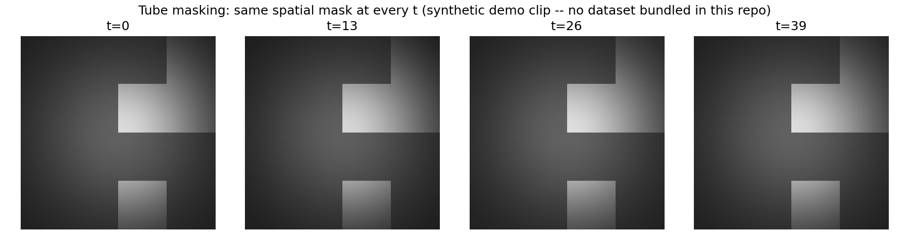
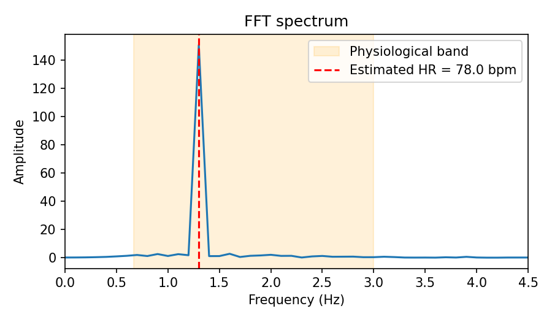

# MaskFusionNet

**Masked Pretraining + Dual-Stream Transformer Architecture for Contactless Heart Rate Estimation from Facial Video**

[]()
[]()
[]()
[]()

> **Read this first:** this repository is a from-scratch, paper-faithful
> reconstruction of MaskFusionNet's architecture, built by auditing a
> previous, buggy implementation line-by-line against the paper. Every
> architectural claim below is backed by a passing test in `tests/`, a
> real (CPU) forward/backward pass, or an explicit citation to the paper's
> equations — see [`AUDIT.md`](AUDIT.md) for the full bug list this fixes.
> **No model has been trained on real data in this repository** (no GPU or
> dataset was available while building it) — see
> [Results](#results) for exactly what has, and hasn't, been run.

---

## 1. Overview

Remote photoplethysmography (rPPG) estimates cardiovascular pulse
information — heart rate, and the waveform it comes from — from ordinary
RGB video, by detecting the faint, periodic color changes in skin caused
by blood volume changes, with no physical sensor contact.

This project implements the architecture from:

> Y. Zhang, J. Shi, J. Wang, Y. Zong, W. Zheng, G. Zhao, **"MaskFusionNet:
> A Dual-Stream Fusion Model With Masked Pre-Training Mechanism for rPPG
> Measurement,"** *IEEE Transactions on Circuits and Systems for Video
> Technology*, vol. 34, no. 11, pp. 11521–11534, Nov. 2024.
> [DOI: 10.1109/TCSVT.2024.3422849](https://doi.org/10.1109/TCSVT.2024.3422849)

The paper proposes a two-stage model: **(1)** a masked-video pretraining
stage that forces the network to extract pulse information from *any*
facial region, not just the easy, high-signal regions, and **(2)** a
dual-stream fine-tuning stage that fuses fine-grained ("adjacent frame")
and coarse-grained ("segmented") temporal features via a learned
interactive-attention fusion block, to estimate the pulse waveform.

## 2. Key Features

- Faithful **3D convolutional stem + tube-token embedding** (Eq. 1-2)
- **Real multi-head self-attention** over the flattened spatio-temporal
  token sequence (Eq. 4-7) — not a per-position gate (see [`AUDIT.md`](AUDIT.md), bug #1)
- **Tube random masking** — one spatial mask per sample, replicated
  identically across every frame (Eq. 3, Fig. 3) — with a unit test that
  checks this programmatically, not just visually
- **Independent** Adjacent Branch (ADB) and Segmented Branch (SEB)
  encoders, with no accidental weight sharing (see [`AUDIT.md`](AUDIT.md), bug #2)
- **Multi-Scale Fusion Block (MFB)** with the paper's exact Q/K/V
  assignment and residual connection (Eq. 8-10)
- A working **two-stage pipeline**: masked pretraining → paper-exact
  weight loading into fine-tuning (Section III-A-2-a) → fine-tuning
- **Reconstruction loss** (spatial + temporal-smoothness, Eq. 15-17) and
  **prediction loss** (negative Pearson + frequency-domain CE/KL, Eq.
  18-19), both implemented and unit-tested
- Subject-independent **UBFC-rPPG** data pipeline (face-crop, split,
  BVP alignment)
- **FFT-based heart-rate estimation** from the predicted waveform, with a
  real-time webcam demo
- Config-driven training (YAML), checkpointing with full
  missing/unexpected-key reporting, Docker support, 34 passing unit tests

Only what's listed above actually exists in this repo — nothing here is
aspirational.

## 3. Architecture

<p align="center">
  
</p>

## 4. Why ADB and SEB?

- **ADB (Adjacent Branch)** uses a fine temporal tube (2 frames per
  token), so it captures **subtle heart-rate variation between adjacent
  frames** — the paper's phrasing.
- **SEB (Segmented Branch)** uses a coarser temporal tube (4 frames per
  token), so it captures **longer-range, more stable patterns**, which
  "helps to alleviate the impact of sudden interference" (Section
  III-A-2-b).
- **MFB** fuses them with cross-branch (interactive) attention: SEB
  provides the query, ADB provides the key/value, so the coarse stream
  selectively pulls in fine-grained detail from the adjacent-frame stream
  without losing its own noise robustness (Eq. 8-10).

## 5. Masked Pretraining

```
Video clip
    │
    ▼
ConvBlock + Tube Embedding   (tokens: [B, C=96, T/4, H/32, W/32])
    │
    ▼
Tube Masking (ρ=0.75, spatial mask replicated across all T)
    │
    ▼
Encoder (12 transformer layers)
    │
    ├──▶ Predictor ──▶ prediction loss (disentangles pulse info from noise)
    │
    ▼
Decoder (6 lightweight transformer layers)
    │
    ▼
Reconstruction (compared against the pre-masking tokens, masked positions only)
```

Why: forcing the encoder to reconstruct heart-rate-bearing tokens **it
never saw** — from *whichever* facial regions happened to stay visible —
prevents it from learning to rely only on the easiest, highest-SNR
patches (forehead/cheek centers), which is exactly what makes rPPG models
fragile to occlusion, motion, and lighting changes (Section III-A-1).

## 6. Fine-tuning

The fine-tuning model's SEB and Fusion Encoder are initialized from the
pretrained encoder's weights — the first 8 of its 12 layers go into SEB,
the last 4 into the Fusion Encoder. ADB is **not** initialized this way
(its tube size differs, so its token/channel layout doesn't match) and
trains from scratch. This mapping is implemented in
[`MaskFusionNet.load_pretrained_encoder()`](src/maskfusionnet/models/maskfusionnet.py)
and verified in `tests/test_shapes.py::test_pretrained_encoder_loading_report`.

## 7. Tensor Dimensions

Actual output of `python scripts/inspect_shapes.py --T 160 --H 128 --W 128`
(paper-scale defaults), run in this environment and saved verbatim to
[`results/tables/shape_trace.txt`](results/tables/shape_trace.txt):

| Stage | Tensor | Shape `[B, C, T, H, W]` |
|---|---|---|
| Input | raw clip | `(1, 3, 160, 128, 128)` |
| Stage 1 | after ConvBlock | `(1, 96, 160, 16, 16)` |
| Stage 1 | tube tokens (Φ_emb, tube 4,4,4) | `(1, 96, 40, 4, 4)` |
| Stage 1 | after masking (ρ=0.75, shape unchanged) | `(1, 96, 40, 4, 4)` |
| Stage 1 | after 12-layer encoder | `(1, 96, 40, 4, 4)` |
| Stage 1 | decoder output (== tube shape) | `(1, 96, 40, 4, 4)` |
| Stage 1 | predictor output | `(1, 160)` |
| Stage 2 | ADB tokens (Ψ_emb, tube 2,4,4) | `(1, 96, 80, 4, 4)` |
| Stage 2 | SEB tokens (Θ_emb, tube 4,4,4) | `(1, 96, 40, 4, 4)` |
| Stage 2 | ADB aligned to SEB (AvgPool ÷2) | `(1, 96, 40, 4, 4)` |
| Stage 2 | after MFB #1 / MFB #2 | `(1, 96, 40, 4, 4)` |
| Stage 2 | after 4-layer Fusion Encoder | `(1, 96, 40, 4, 4)` |
| Stage 2 | predicted rPPG signal | `(1, 160)` |

## 8. Dataset

**This reproduction uses [UBFC-rPPG](https://sites.google.com/view/ybenezeth/ubfcrppg),
not VIPL-HR / COHFACE / PURE — the three datasets the paper itself
evaluates on.** This is a deliberate scope decision (UBFC is small,
public, and easy to obtain), not a claim of exact reproduction. Concretely:

| | Paper's setup | This repo's setup |
|---|---|---|
| Datasets | VIPL-HR, COHFACE, PURE | UBFC-rPPG |
| Face detector | FAN | Haar cascade (OpenCV, no extra model download) |
| Split | paper's own protocol (e.g. 5-fold on VIPL-HR) | subject-level 70/15/15 |
| Reported numbers | Tables I–IV of the paper | **none yet — see [Results](#13-results)** |

**Do not read any number in this repository as reproducing the paper's
Table I–IV results.** Different dataset, different preprocessing,
different split. See [`data/README.md`](data/README.md) for the full
UBFC-rPPG layout and ground-truth format this code expects.

## 9. Dataset Preparation

```bash
export MASKFUSIONNET_UBFC_ROOT=/absolute/path/to/UBFC-rPPG
python scripts/prepare_ubfc.py
```

This only discovers subjects and prints the subject-level train/val/test
split that training will use — it does not copy or re-encode any video
(UBFC's raw layout is read directly by `UBFCrPPGDataset`).

## 10. Installation

```bash
git clone <this-repo>
cd MaskFusionNet
python -m venv .venv && source .venv/bin/activate
pip install -r requirements.txt
pip install -e .
pytest tests/ -v          # 34 tests, should all pass, no dataset needed
```

Or with Docker:

```bash
docker build -t maskfusionnet .
docker run maskfusionnet   # runs scripts/inspect_shapes.py as a smoke test
```

## 11. Training

```bash
# Stage 1: masked pretraining
python scripts/train_pretrain.py --config configs/pretrain.yaml

# Stage 2: fine-tuning (loads Stage 1's checkpoint per configs/finetune.yaml)
python scripts/train_finetune.py --config configs/finetune.yaml

# Fine-tune from scratch instead (ablation: no pretraining)
python scripts/train_finetune.py --config configs/finetune.yaml --no_pretrain
```

Both scripts support `--resume <checkpoint.pt>`, read `data.root` from
`configs/*.yaml` (which itself reads the `MASKFUSIONNET_UBFC_ROOT`
environment variable — no path is hard-coded anywhere), and write
per-epoch checkpoints + a CSV metrics log.

## 12. Evaluation

```bash
python scripts/evaluate.py --config configs/finetune.yaml \
    --checkpoint checkpoints/finetune/best.pt
```

Computes MAE / RMSE / Pearson r on per-clip HR estimates and mean SNR on
the filtered waveform, over the held-out **subject-independent** test
split, and writes `results/tables/eval_results.json`.

## 13. Results

**Not yet run.** No GPU and no copy of UBFC-rPPG were available while
building this repository, so no training has taken place and no accuracy
numbers exist anywhere in this repo. The table below is the format
`scripts/evaluate.py` will populate — it is intentionally empty rather
than filled with placeholder numbers:

| Model | MAE (bpm) | RMSE (bpm) | Pearson r | SNR (dB) |
|---|---|---|---|---|
| MaskFusionNet (this repo, UBFC-rPPG) | *pending* | *pending* | *pending* | *pending* |

What **has** been verified (all reproducible by running the commands
shown):

- **Forward/backward correctness**, both stages, at paper-scale input
  size, no NaNs, gradients reach every parameter.
- **34/34 unit tests pass** (`pytest tests/ -v`): tube-mask consistency,
  attention actually mixing tokens, MFB's residual connection, the
  paper-exact 8/4/0 pretrain→finetune weight-loading split, and BPM
  recovery from synthetic sinusoids across 45–160 bpm within 3 bpm.
- **The training loop itself** (optimizer step, checkpointing, CSV
  logging, resume) works end-to-end against a tiny synthetic dataset
  standing in for UBFC-rPPG.

See [`AUDIT.md`](AUDIT.md) for the exhaustive list of what this fixes in
the previous implementation, and exactly what was and wasn't run.

## 14. Qualitative Results

Since no trained checkpoint exists yet, the figures below demonstrate the
**signal-processing pipeline** (filter → FFT → BPM) on a synthetic
sinusoid of *known* frequency, and the **masking mechanism** on a
synthetic demo clip — both clearly not model predictions, and both
regenerable by the commands shown.

**Tube masking** (identical spatial mask at every frame — the property
the paper's Fig. 3 illustrates):



**Signal-processing verification** (78 bpm synthetic sinusoid → FFT
correctly recovers 78.0 bpm):



Once a real checkpoint exists, `scripts/inference.py --ground_truth ...`
produces the equivalent predicted-vs-ground-truth BVP plot from real data.

## 15. Real-Time Demo

```bash
python scripts/realtime_demo.py --checkpoint checkpoints/finetune/best.pt
```

Pipeline: `Webcam → Face detection → Rolling buffer → MaskFusionNet →
rPPG → Bandpass → FFT → BPM`. The displayed BPM is always either the
freshly computed estimate or a documented moving-average over the last N
estimates — see [`AUDIT.md`](AUDIT.md), bug #8, for what this replaced
(the original demo injected literal random jitter into the displayed
number).

## 16. Project Structure

```
src/maskfusionnet/
  models/       ConvBlock, EmbeddingLayer, attention, transformer,
                masking, MFB, Stage-1 & Stage-2 models
  data/         UBFC-rPPG dataset, subject-level splits, preprocessing
  losses/       reconstruction loss (Eq 15-17), prediction loss (Eq 18-19)
  signal/       bandpass filtering, FFT, waveform -> BPM
  training/     generic Trainer, per-stage step functions
  utils/        metrics, checkpoints, config loading, logging, plotting
scripts/        CLI entry points (train, evaluate, inference, demo, ...)
tests/          34 unit tests, no dataset required
configs/        YAML configs for both training stages + dataset settings
results/        generated figures/tables (see file-level notes on what's
                real vs. synthetic-verification)
AUDIT.md        line-by-line bug report against the original repository
```

## 17. Engineering Details

- **PyTorch** end to end; mixed precision (`--use_amp` in config) and
  gradient accumulation supported in `Trainer`, though untested on real
  GPU hardware here (no GPU was available while building this).
- **Checkpointing** always bundles model + optimizer + scheduler state +
  epoch + config + metrics, and always reports missing/unexpected keys —
  never a silent `strict=False` (see [`AUDIT.md`](AUDIT.md), bug #9).
- **Config-driven**: every hyperparameter that has a paper-specified value
  is set to it in `configs/*.yaml`, annotated `(paper)`; every UBFC-specific
  choice is annotated `(ours)`.
- **Docker** support for a reproducible environment.
- **34 automated tests**, all data-free (synthetic tensors only), so CI
  can run them without a GPU or dataset.
- Deliberately **no** extra infrastructure (no message queues, no
  orchestration, no experiment-tracking service) — the stack is sized to
  the problem.

## 18. Limitations

- **No trained checkpoint or accuracy numbers exist yet** — everything
  above the model/data/loss/test layer (real training, real evaluation)
  is unrun, for lack of a GPU and a UBFC-rPPG download in the environment
  that built this.
- UBFC-rPPG is a small, single-scenario (static, well-lit, near-frontal)
  dataset; a model trained only on it should not be expected to
  generalize the way the paper's VIPL-HR-trained models do.
- Face detection uses a Haar cascade, not the paper's FAN detector — less
  robust to extreme pose/occlusion (see [`AUDIT.md`](AUDIT.md), ambiguity notes,
  and `data/preprocessing.py`).
- Several paper details are underspecified (exact pooling stride, masking
  applied at pixel vs. token resolution, MFB weight sharing, HR-binning
  procedure); every such gap is resolved with a documented, explicit
  assumption rather than silently guessed — see `AUDIT.md`, "Ambiguities."
- CPU-only environments will find Stage 1 pretraining (400 epochs in the
  paper's own protocol) impractically slow; `configs/pretrain.yaml`'s
  batch size, clip length, and image size are all reducible for smaller
  hardware.

## 19. Paper

> Y. Zhang, J. Shi, J. Wang, Y. Zong, W. Zheng and G. Zhao, "MaskFusionNet:
> A Dual-Stream Fusion Model With Masked Pre-Training Mechanism for rPPG
> Measurement," *IEEE Transactions on Circuits and Systems for Video
> Technology*, vol. 34, no. 11, pp. 11521-11534, Nov. 2024,
> doi: 10.1109/TCSVT.2024.3422849.

## 20. Citation

```bibtex
@article{zhang2024maskfusionnet,
  title   = {MaskFusionNet: A Dual-Stream Fusion Model With Masked Pre-Training Mechanism for rPPG Measurement},
  author  = {Zhang, Yizhu and Shi, Jingang and Wang, Jiayin and Zong, Yuan and Zheng, Wenming and Zhao, Guoying},
  journal = {IEEE Transactions on Circuits and Systems for Video Technology},
  volume  = {34},
  number  = {11},
  pages   = {11521--11534},
  year    = {2024},
  doi     = {10.1109/TCSVT.2024.3422849}
}
```

This repository is an independent re-implementation for research/education
purposes; see [`LICENSE`](LICENSE).
